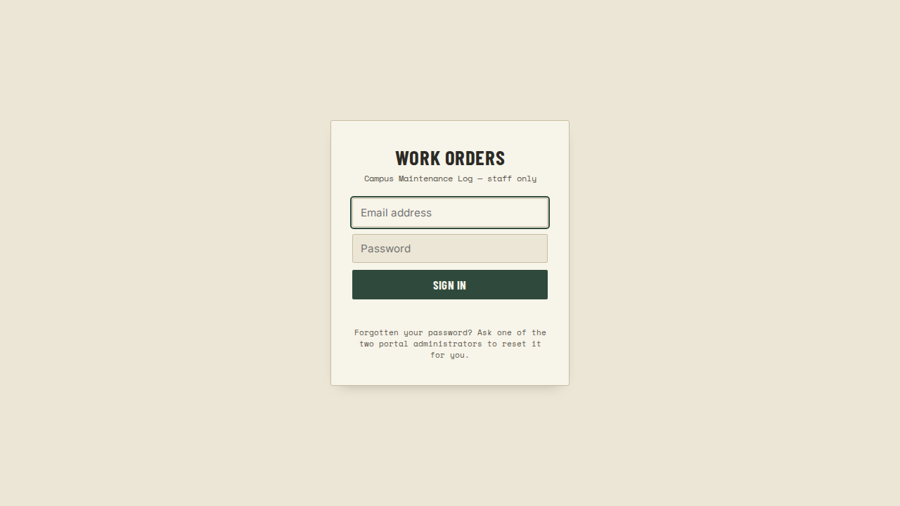
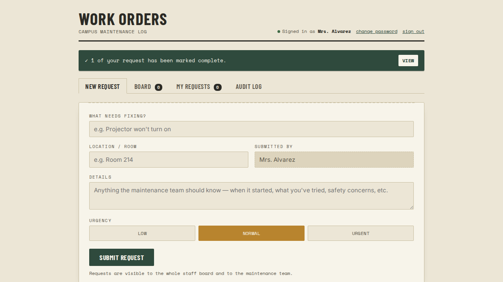
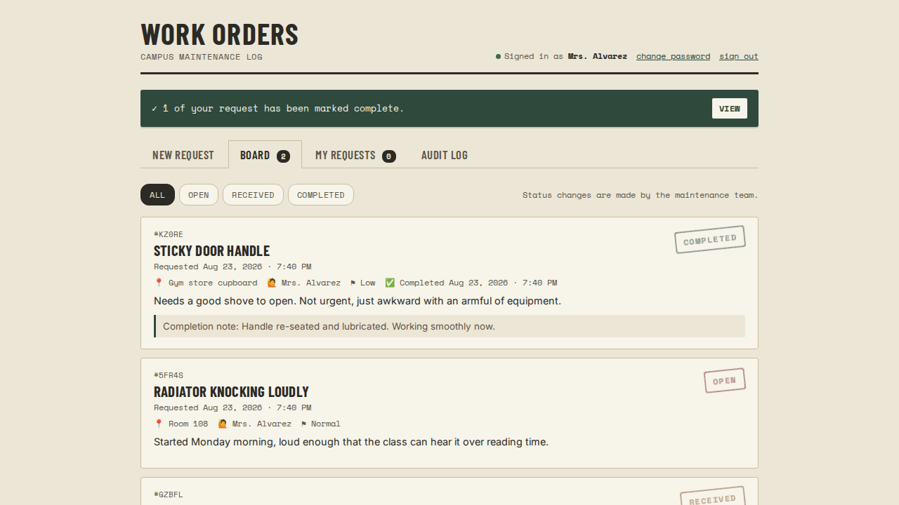
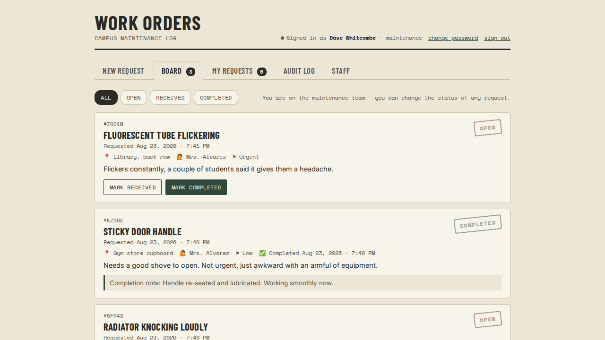
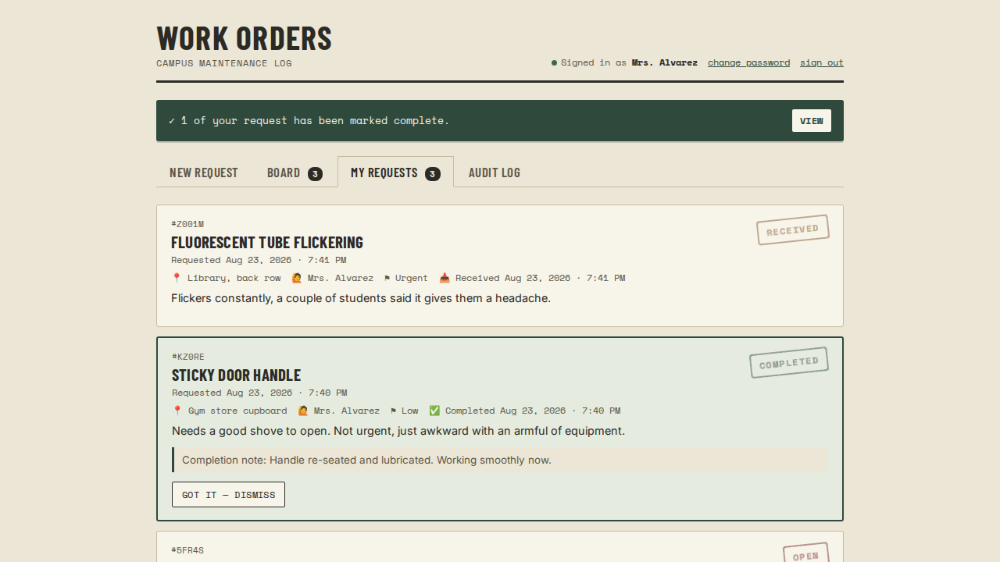
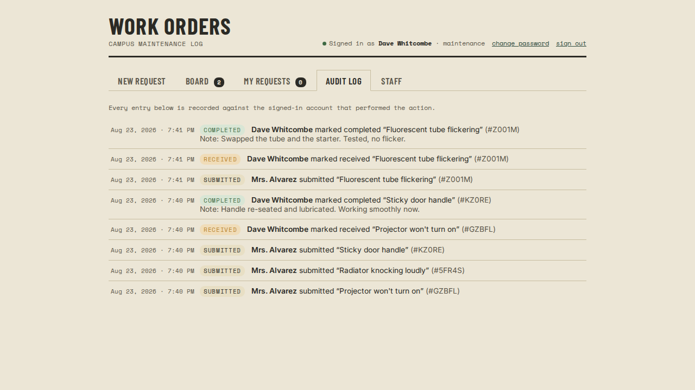
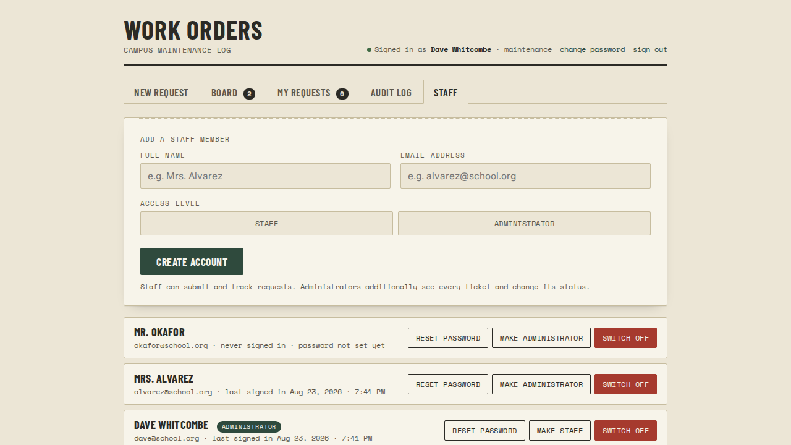
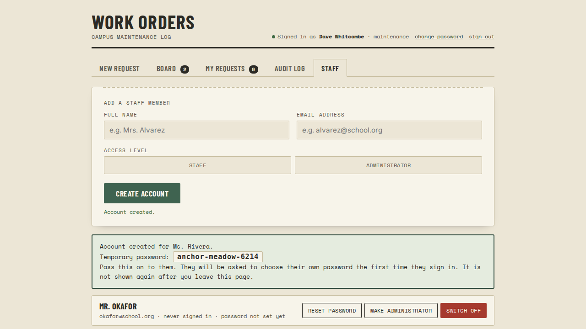
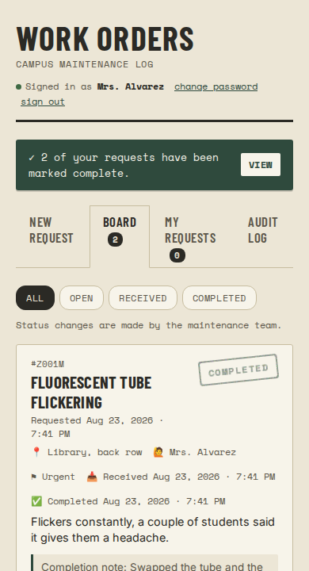

# Work Orders — what it looks like

All names, rooms and passwords below are throwaway test data from a local test
run. Nothing here is real school data.

---

### 1. Sign in

One account per person, instead of the single shared `SCHOOL2026` passcode.

---

### 2. Submitting a request

Same slip as the prototype. "Submitted by" is now filled in from the account you
signed in with, so nobody can raise a ticket under someone else's name.

---

### 3. The board, seen by a teacher

Everyone can see every request and its status. No status buttons, no Staff tab.

---

### 4. The same board, seen by an administrator

Mark Received and Mark Completed on every open ticket, plus the Staff tab.

---

### 5. The completion notice

When an administrator marks a job complete, the person who raised it gets the
banner at the top and the highlighted card, with the completion note. It appears
on its own within a few seconds — no reloading.

---

### 6. Audit log

Recorded against the account that was signed in, not a typed-in name.

---

### 7. Managing staff

Add a person, reset a forgotten password, promote someone to administrator, or
switch off an account when they leave.

---

### 8. A newly created account

The temporary password is shown once. The person is forced to choose their own
the first time they sign in.

---

### 9. On a phone

The board on a 390px-wide screen — how most staff will actually raise a ticket.

