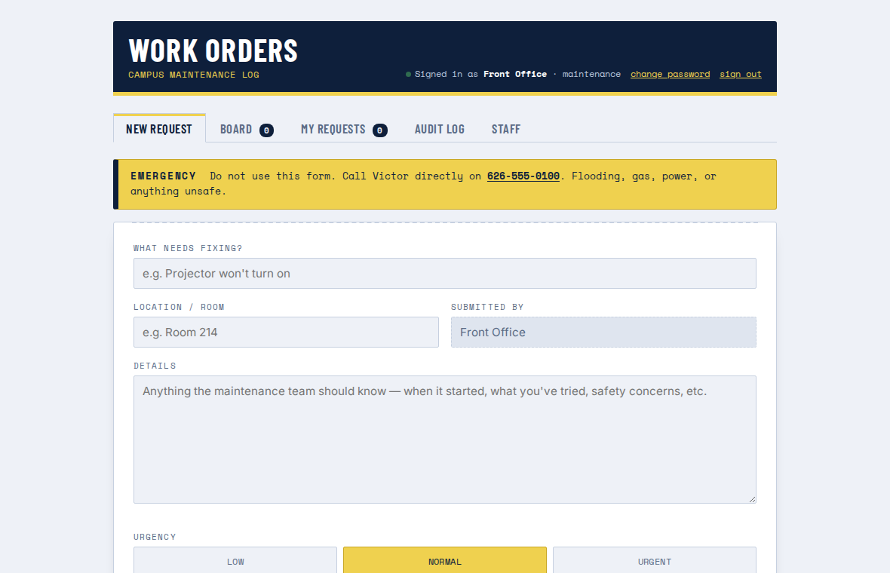
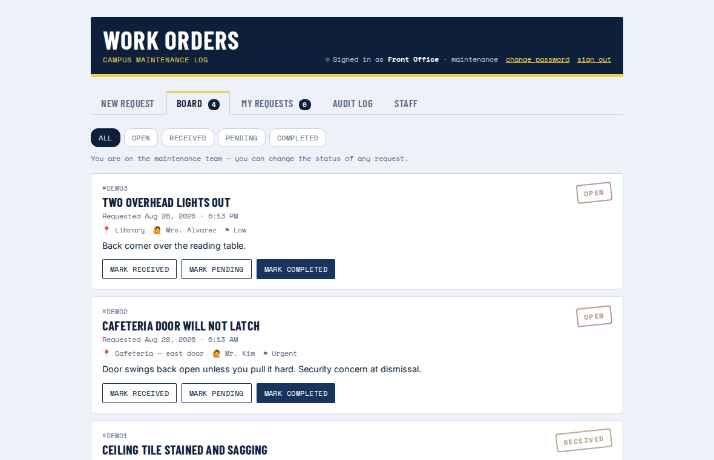
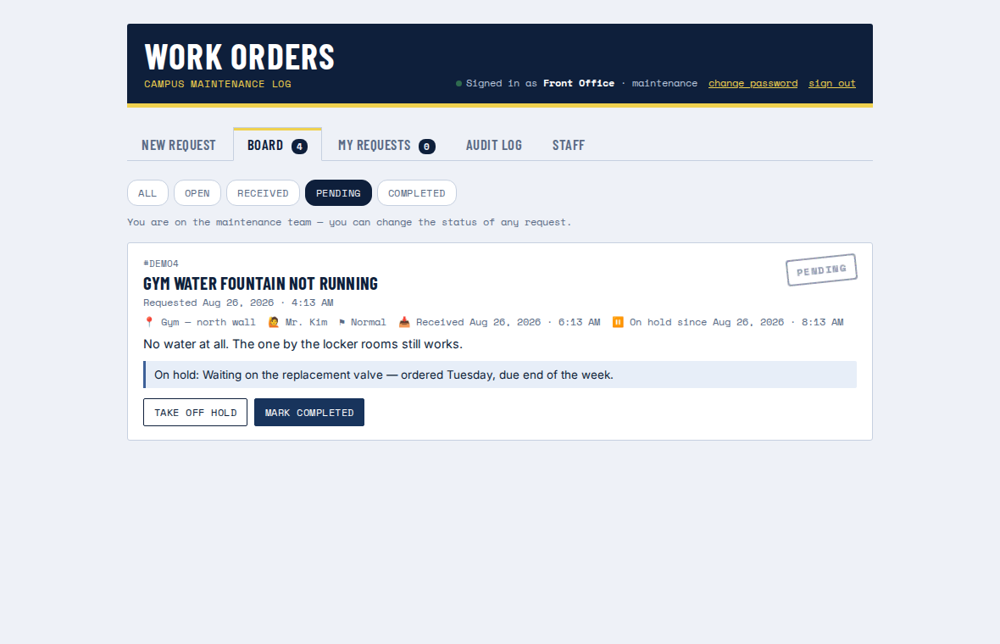
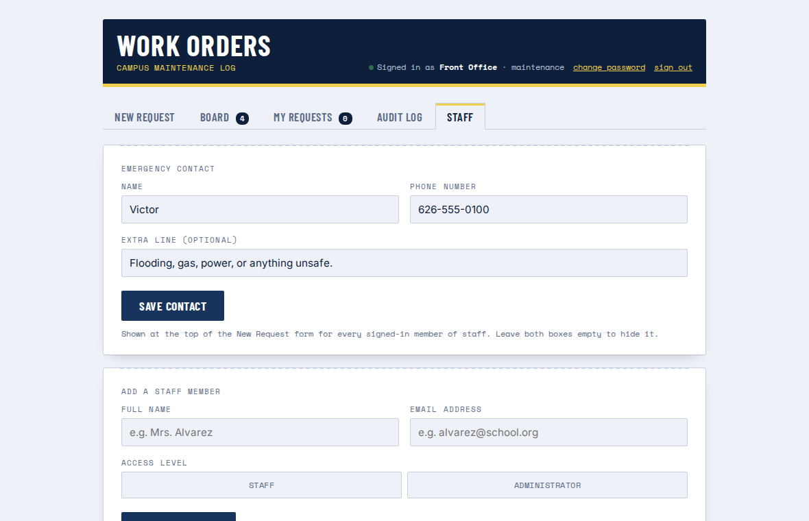
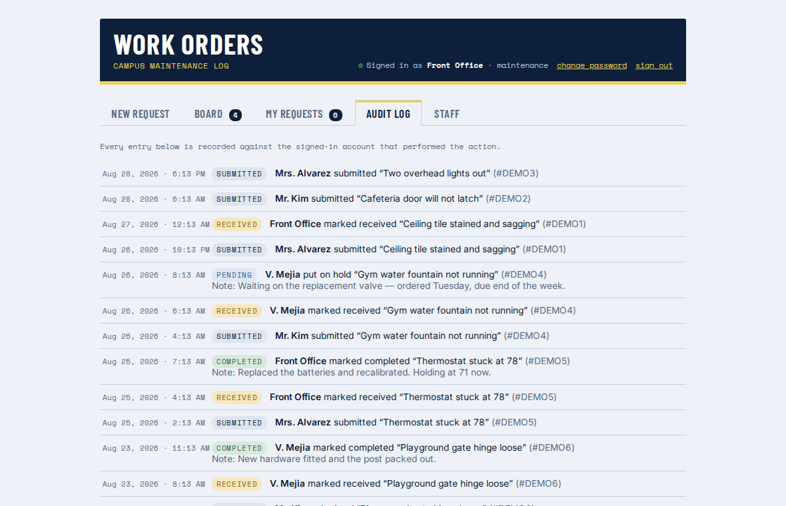
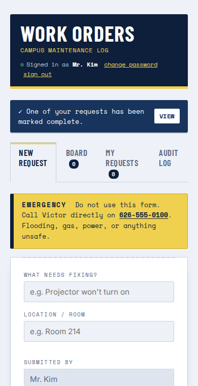

# Work Orders — what it looks like

All names, rooms and passwords below are throwaway test data from a local test
run. Nothing here is real school data.

---

### 1. Sign in

One account per person, instead of the single shared `SCHOOL2026` passcode.

---

### 2. Submitting a request

Same slip as the prototype. "Submitted by" is now filled in from the account you
signed in with, so nobody can raise a ticket under someone else's name.

---

### 3. The board, seen by a teacher

Everyone can see every request and its status. No status buttons, no Staff tab.

---

### 4. The same board, seen by an administrator

Mark Received and Mark Completed on every open ticket, plus the Staff tab.

---

### 5. The completion notice

When an administrator marks a job complete, the person who raised it gets the
banner at the top and the highlighted card, with the completion note. It appears
on its own within a few seconds — no reloading.

---

### 6. Audit log

Recorded against the account that was signed in, not a typed-in name.

---

### 7. Managing staff

Add a person, reset a forgotten password, promote someone to administrator, or
switch off an account when they leave.

---

### 8. A newly created account

The temporary password is shown once. The person is forced to choose their own
the first time they sign in.

---

### 9. On a phone

The board on a 390px-wide screen — how most staff will actually raise a ticket.

---
---

# The 29 August changes

The school colours, the Pending status and the emergency notice. Everything
below is a local test run — invented names, invented rooms, and a placeholder
phone number, because this page is public.

---

### 10. School colours, and the emergency notice

Navy, gold and white, taken from the High Point Academy site. The yellow line at
the top of the request form is the emergency contact — the number is a link, so
on a phone it dials with one tap.

---

### 11. Pending on the filter row

A fourth chip alongside All / Open / Received / Completed. Maintenance now has
three buttons on a request: Mark Received, Mark Pending, Mark Completed.

---

### 12. A request on hold, and why

Pressing Mark Pending asks what the request is waiting on. That line shows on
the card for everyone — including the person who raised it — and is emailed to
them. When the part arrives, Take off hold puts it back to Received.

---

### 13. Setting the emergency contact

On the Staff tab. Whoever is on call can be changed by the office in a few
seconds, without a developer and without restarting anything. Clearing both
boxes removes the notice from the form.

---

### 14. The audit log

Going on hold and coming off hold are recorded like every other action, with the
reason attached.

---

### 15. On a phone

